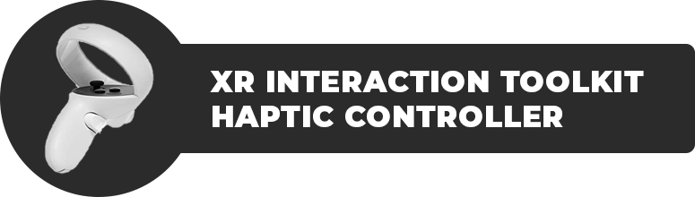
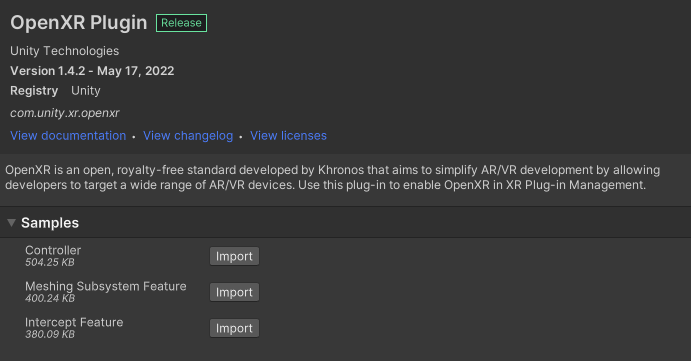
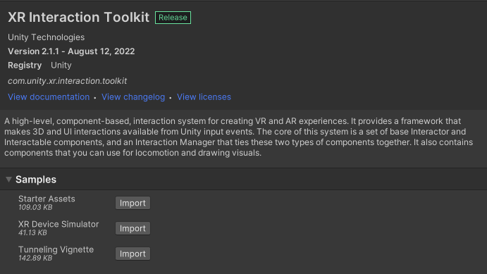
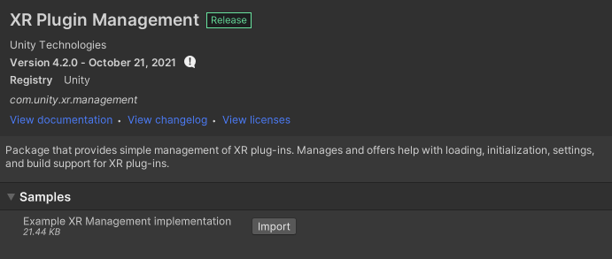
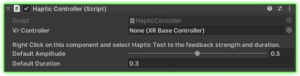
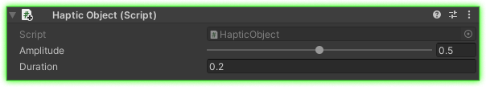

<!-- PROJECT LOGO -->

 
 

Custom Haptic Controller to assign haptic feedback on gameobjects.

 

<!-- TABLE OF CONTENTS -->

  
Table of Contents

  <ol>
    <li><a href="#about">About</a></li>
    <li><a href="#functions">Functions</a></li>
    <li><a href="#getting-started">Getting Started</a></li>
    <li><a href="#example">Example</a></li>
    <li><a href="#contact">Contact</a></li>
  </ol>

<!-- ABOUT THE PROJECT -->
## About

 
Do you want each specific object to have their own custom haptic feedback when interacted in VR?
 
This [code](https://github.com/hamdanbasri/HapticController-UnityXRInteractionToolkit/blob/main/HapticController.cs) is here just to do that.
 
Justin P Barnett has an in-depth [video](https://www.youtube.com/watch?v=-5tiV-lyYP8&ab_channel=JustinPBarnett) how he made his version.

  <h3>Project Requirements</h3>
    <ol>
      <li>Unity project is set up for VR Games.</li>
      <li>Or follow along this [tutorial](https://www.youtube.com/watch?v=yxMzAw2Sg5w&ab_channel=JustinPBarnett) on how to setup.</li> 
    </ol>

  <h3>Package Manager Requirements</h3>
    <td>
      <ol>
        <li>Open XR Plugin [Tested on 1.4.2]</li>
        <li>XR Interaction Toolkit [Tested on 2.1.1]</li>
        <li>XR Plugin Management [Tested on 4.2.0]</li>
      </ol>  
    </td>

<!-- FUNCTIONS -->
## Functions

* Control the haptic feedback's amplitude and duration on any gameobject.  

<!-- GETTING STARTED -->
## Getting Started

* Add <strong>XROrigin</strong> to the scene.
* Attach the HapticController.cs script on both the LeftHand Controller and RightHand Controller.
* Add a SphereCollider on both the LeftHand Controller and RightHand Controller and set the trigger to true.
* Create a Cube in the scene and rename it to HapticCube.
* Add a Rigidbody component to the HapticCube, disable the gravity and enable the isKinematic.
* Create a tag called HapticObject and assign the tag to the HapticCube.
* Add a XR Simple Interactable component to the HapticCube.
* Add the HapticObject.cs script to the HapticCube.
* Adjust the Amplitude and Duration.
* Press Play, put on your headset, reach out towards the HapticCube using your controller and test the feedback.

<h2>Pro-Tip:</h2>
You can right click on the HapticController component and select Haptic Test when playing. This will give you a sense of how strong do you want the feedback to be.

<h2>Known-Issues:</h2>
Duration of the haptic feedback is limit to 2 seconds. Let me know if there is a way to increase the duration.

<!-- USAGE EXAMPLES -->
## Example

Attached on both the LeftHand Controller and RightHand Controller.

 
        <table>
        <tr>
            <td>Variable</td>
            <td>Annotation</td>
        </tr>
        <tr>
            <td>VR Controller</td>
            <td>Automatically find the XR Base Controller in your GameObject component</td>
        </tr>
        <tr>
            <td>Default Amplitude</td>
            <td>Set the default strength of the haptic feedback</td>
        </tr>
        <tr>
            <td>Default Duration</td>
            <td>Set the default duration of the haptic feedback</td>
        </tr>
        </table>

 

Attached to the Haptic object.

 
        <table>
        <tr>
            <td>Variable</td>
            <td>Annotation</td>
        </tr>
        <tr>
            <td>Amplitude</td>
            <td>Set the strength of the haptic feedback on this GameObject</td>
        </tr>
        <tr>
            <td>Duration</td>
            <td>Set the duration of the haptic feedback</td>
        </tr>
        </table>

<!-- CONTACT -->
## Contact

[![LinkedIn][linkedin-shield]][linkedin-url]

(<a href="#readme-top">back to top</a>)

<!-- MARKDOWN LINKS & IMAGES -->
<!-- https://www.markdownguide.org/basic-syntax/#reference-style-links -->
[linkedin-shield]: https://img.shields.io/badge/-LinkedIn-black.svg?style=for-the-badge&logo=linkedin&colorB=555
[linkedin-url]: https://linkedin.com/in/hamdanbasri

